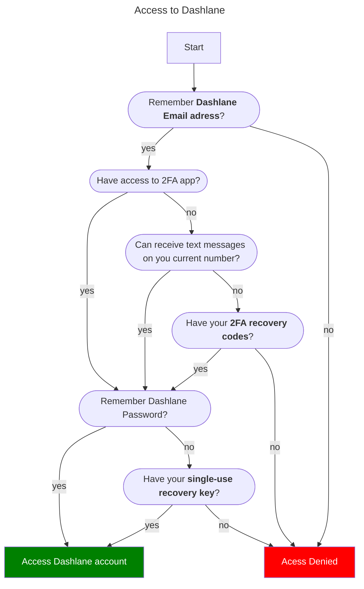

```mermaid
---
title : "Access to Dashlane"
---
flowchart TD
A[Start] --> B(["`Remember **Dashlane Email adress**?`"])
B -- yes --> C([Have access to 2FA app?])
C -- yes --> D([Remember Dashlane Password?])
D -- yes --> S[Access Dashlane account] 
B -- no --> X[Acess Denied]
C -- no --> E([Can receive text messages on you current number?])
E -- yes --> D
E -- no --> G(["`Have your **2FA recovery codes**?`"])
G -- yes --> D
G -- no --> X
D -- no --> F(["`Have your **single-use recovery key**?`"])
F -- yes --> S
F -- no --> X
style S fill:green,color:#fff;
style X fill:red,color:#fff;
```

