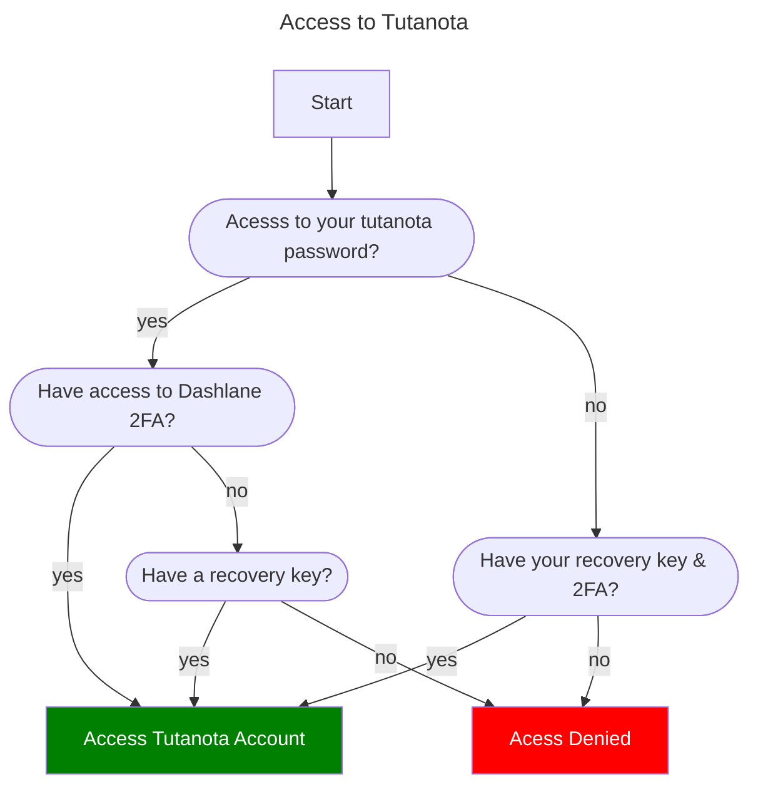

Dashlane has both my password, 2FA and recovery key.
Without my Tutanota password and recovery code printed out, I permenantly loose access to tutanota if I loose access to Dashlane.   

### Steps to increase access 
- Print Recovery code