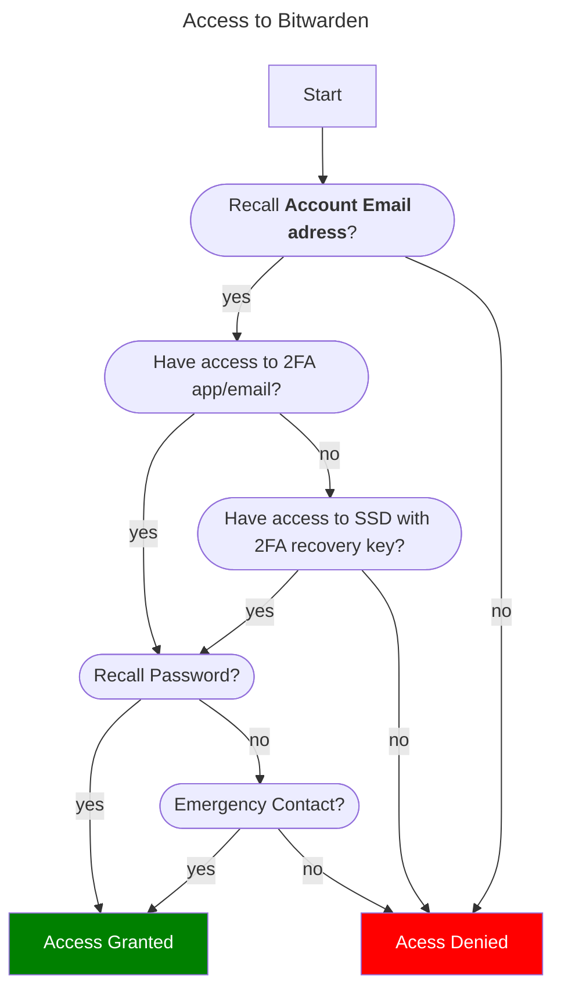

### References
[I Forgot my Master Password \| Bitwarden](https://bitwarden.com/help/forgot-master-password/)
* Opsætning af totrins-login kan permanent låse en bruger ude af sin Bitwarden-konto. En gendannelseskode muliggør kontoadgang, såfremt den normale totrins-loginudbyder ikke længere kan bruges
* 2FA Både email og Authy