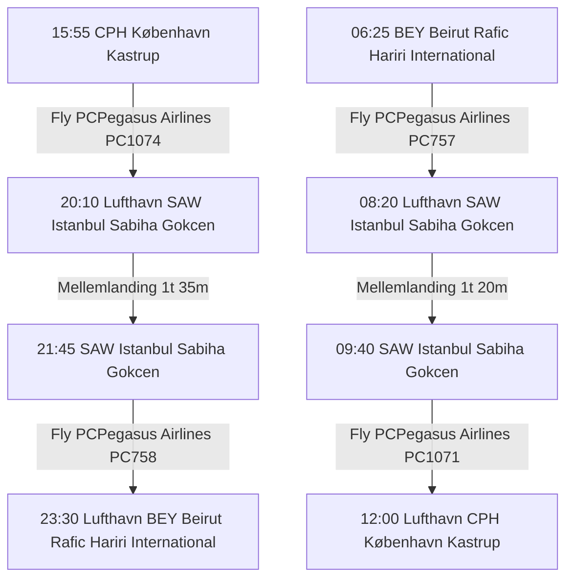

## Booking
* E-billet: 6242270146998
* Booking ID: 2877550632
* 1 x lille taske (40 x 30 x 15 cm)
* 1 x 8Kg håndbagage (40 x 55 x 20 cm)
* You are allowed 1 piece of cabin baggage with a maximum size of 55x40x20 cm , weighing up to 8kg, as well as 1 underseat bag with a maximum size of 40x30x15 cm, weighing up to 3kg.
* If you bring any baggage exceeding the size limit or an additional piece of baggage, 50EURan extra fee of, will be applied during boarding.
## Udgående Fly

### Fly 1
- **Afrejse:** 15:55  
- **Lufthavn:** (CPH) København Kastrup  
- **Fly:** PCPegasus Airlines PC1074  
- **Ankomst:** 20:10  
- **Lufthavn:** (SAW) Istanbul Sabiha Gokcen  

### Mellemlanding
- **Varighed:** 1t 35m  

### Fly 2
- **Afgang:** 21:45  
- **Lufthavn:** (SAW) Istanbul Sabiha Gokcen  
- **Ankomst til Beirut:** 23:30  
- **Lufthavn:** (BEY) Beirut Rafic Hariri International  

**Ophold:** 4 nætter i Beirut  

---

## Retur Fly

### Fly 1
- **Afrejse:** 06:25  
- **Lufthavn:** (BEY) Beirut Rafic Hariri International  
- **Fly:** PCPegasus Airlines PC757  
- **Ankomst:** 08:20  
- **Lufthavn:** (SAW) Istanbul Sabiha Gokcen  

### Mellemlanding
- **Varighed:** 1t 20m  

### Fly 2
- **Afgang:** 09:40  
- **Lufthavn:** (SAW) Istanbul Sabiha Gokcen  
- **Ankomst til København:** 12:00  
- **Lufthavn:** (CPH) København Kastrup  

### Gaver 
- Tommy og Susanne 
	- Nødder og Sesambrød
- Caroline 
	- Nødder 
	- Kaake 
	- One Piece bededragt 