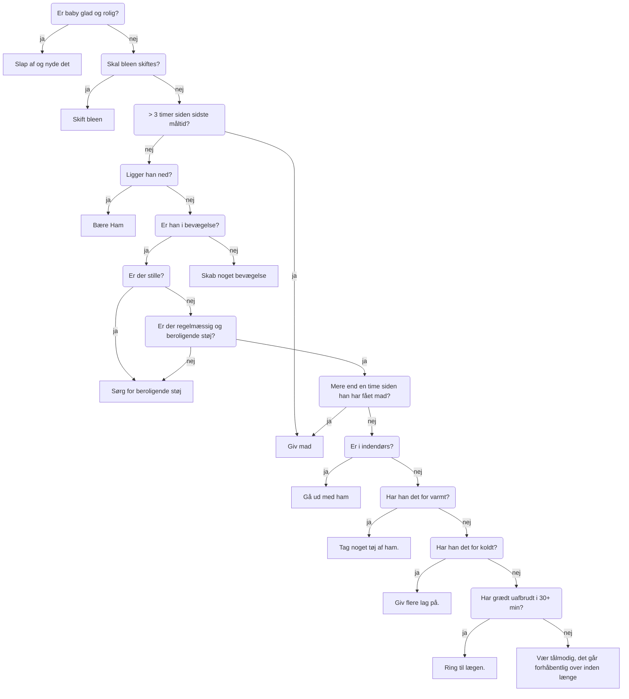

```mermaid
flowchart TD
R(Er baby glad og rolig?) -- ja --> S[ Slap af og nyde det]
R -- nej --> BL -- ja --> SB[Skift bleen]
BL(Skal bleen skiftes?) -- nej --> M(> 3 timer siden sidste måltid?) -- ja --> GM[Giv mad ]
M -- nej --> LN(Ligger han ned?) -- ja --> BH[Bære Ham]
LN -- nej --> BV(Er han i bevægelse?) 
BV -- ja --> MS(Er der stille?) -- ja --> WN[Sørg for beroligende støj]
BV -- nej --> SNB[Skab noget bevægelse ]
MS -- nej --> DS(Er der regelmæssig og beroligende støj?) 
DS -- ja --> TM(Mere end en time siden han har fået mad?) -- ja --> GM
DS -- nej --> WN
TM -- nej --> IN(Er i indendørs?) -- ja --> UD[Gå ud med ham]
IN -- nej --> V(Har han det for varmt?) -- ja --> TA[Tag noget tøj af ham.]
V -- nej --> K(Har han det for koldt?) -- ja --> LP[Giv flere lag på.]
K -- nej --> G30(Har grædt uafbrudt i 30+ min?) -- ja --> RL[Ring til lægen.]
G30 -- nej --> VT[Vær tålmodig, det går forhåbentlig over inden længe]
```

