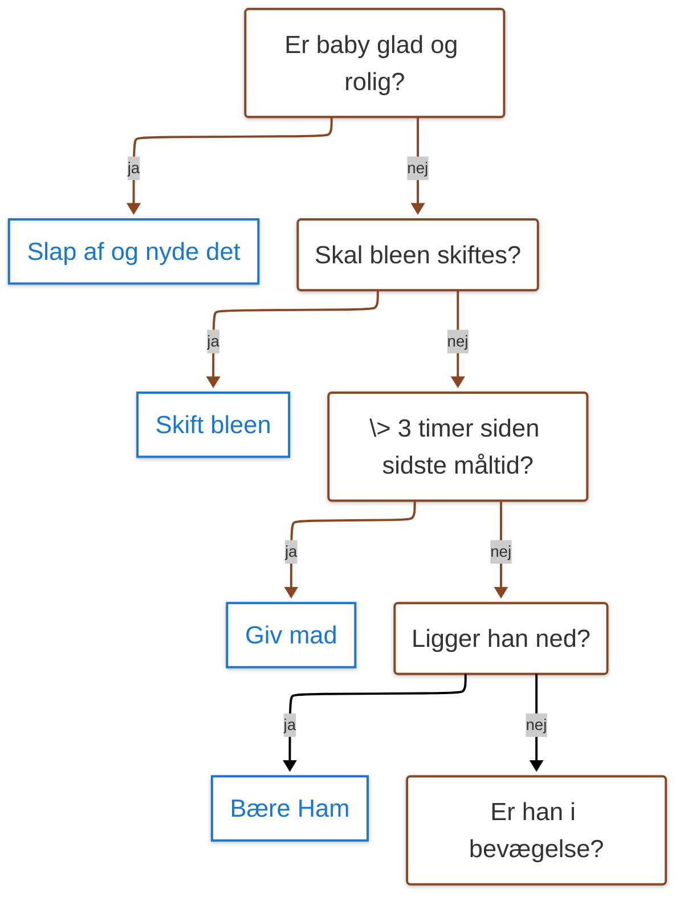
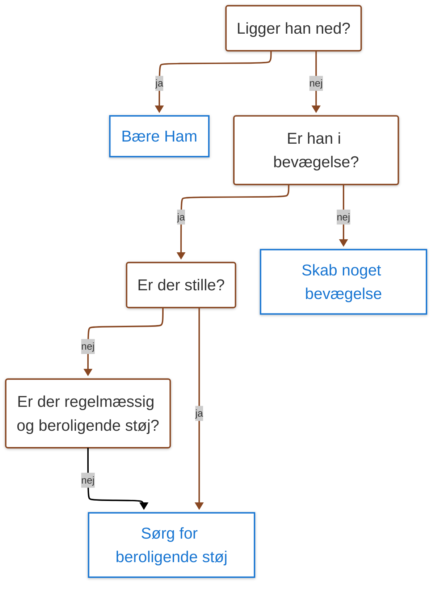
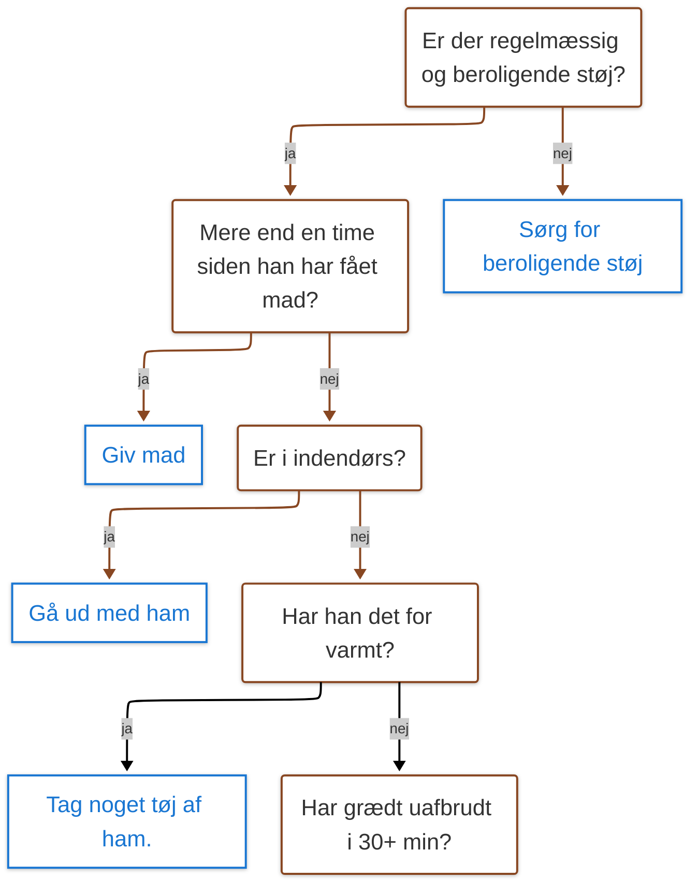
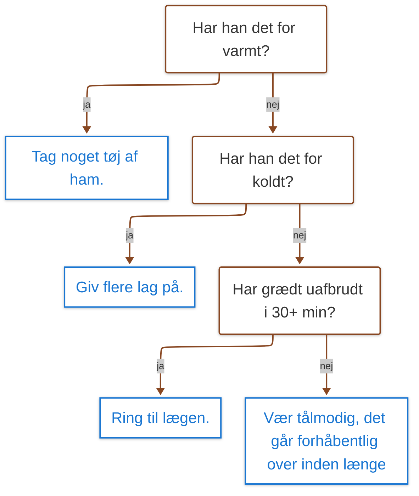

## Verison 2
# Guide til rolig Elias

For to år siden meldte Elias sin ankomst til verden på en mørk og stormfuld oktobernat. De måneder, der fulgte, var uvante og overvældende. Jeg reagerede ved at ty til det, jeg var blevet god til gennem mit arbejde; data og systemer.

Vi trackede alt fra søvn, mad og bleer til vægt og vejrtrækning. Jeg plottede hans vækstkurve op mod WHO’s standarder og satte alarmer og påmindelser op. I en note fra den tid fandt jeg et flowchart med titlen _"Guide til rolig Elias"_. Et beslutningstræ for, hvordan jeg skulle håndtere de øjeblikke, hvor Elias var urolig og svær at trøste.

Det lyder måske som overkill, jeg kalder det en arbejdsskade. Men det gav mig ro, aflastede min hjerne og skabte en følelse af kontrol, når alt føltes nyt og usikkert. Selvfølgelig glemte vi at skrive noget ind en gang imellem, og nogle gange måtte jeg justere logikken. Livet med et lille barn lader sig ikke planlægge ned til mindste detalje. Men systemet var der som et anker i stormen. Og med tiden blev vi selvkørende, gav mere slip og opdagede, at amning løser alt.

Det er det, data og systemtænkning kan give: fodfæste i det uoverskuelige. Det handler ikke om at styre hver eneste detalje, men om at skabe mønstre, der kan vise vej, uanset om det drejer sig om et grædende barn, en udfordring på arbejdet eller forretningsstrategi.

Nu står jeg igen over for en periode, der bliver uvant og sikkert også overvældende. Jeg skal være selvstændig og starte virksomhed op med en forretningspartner. Det er et skridt ud i det ukendte. Og nu igen får jeg brug for at skabe struktur i uorden, bygge systemer, der hjælper os med at navigere. Systemer, der ikke kun består af tal og processer, men også rummer plads til at trække vejret, stole på os selv og lære undervejs.

Hvordan har du taklet ukendte og overvældende situationer? Og har du fanget dig selv i at bruge vaner og metoder fra dit arbejdsliv i dit private?

--- 

[[Guide til rolig Elias]]

Jeg faldt over en note fra da Elias var nyfødt  og jeg snart skulle på barsel for første gang. Et flowchart med titlen "Guide til rolig Elias". 

For 2 år siden meldte min søn sin ankomst, en mørk og stormfuld nat. Perioden derefter var uvandt og til tider overvældende. Jeg reagerede ved at tye til det jeg var blevet bedst til; data og systemer. 
Vi trackede alt søvn, mad, bleer til vægt og temperatur. Jeg plottede han vækst op mod whos data for børns vækst. 
Jeg sat automatiske alarmer og reminders op. 
Og jeg lavede et deterministisk flow over hvordan jeg skulle håndtere situationer hvor Elias var urolig og svær at tryste. 
Det gav mig ro, aflastede min hjerne og gav mig en følelse af genvundet kontrol. 

- Nodes with parentheses `()` are assigned the `roundedNode` class.
- Nodes with brackets `[]` are assigned the `stadiumNode` class.

## Diagrams
To update the styling for all diagrams, you need to modify the `classDef` and `linkStyle` sections in each mermaid diagram block. Here's how you can update each diagram:

### Diagram 1

### Diagram 2

### Diagram 3

### Diagram 4

